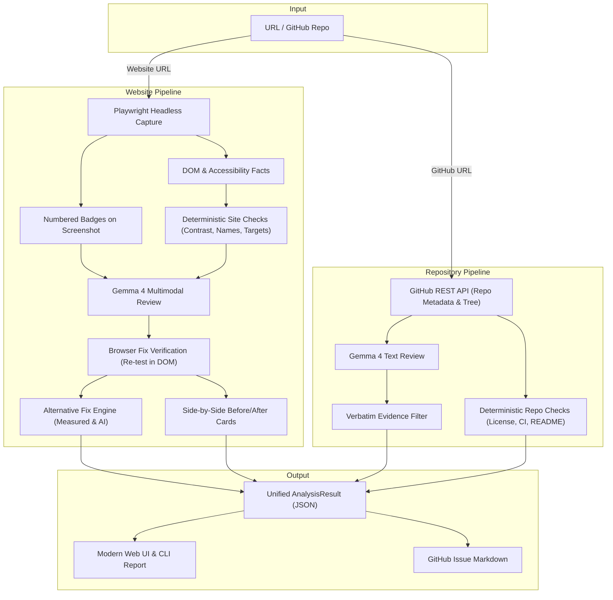

# SightLine — AI-Assisted Accessibility & Repository Inspector

An open-source inspector that pairs deterministic WCAG 2.1/2.2 accessibility and repository health checks with multimodal Gemma 4 reasoning, browser-verified fixes, and visual comparison cards.

---

## Quick Visual Anchor: 5-Second Offline Demo

You can explore the full, interactive SightLine UI in 5 seconds without needing an API key or external network access:

```bash
# 1. Launch the web UI
sightline --web

# 2. Open either demo link in your browser:
#    Website demo:   http://localhost:8000?demo=site
#    Repository demo: http://localhost:8000?demo=repo
```

Both bundled demos showcase live visual badge annotations, verified before/after diff cards, computed alternative fixes, and exportable GitHub issues.

---

## Key Features

- **Deterministic Website Accessibility Checks**:
  - Color contrast ratio calculations based on WCAG 2.1 algorithms with font-size thresholds (3:1 for large text, 4.5:1 for normal body text).
  - Identification of interactive elements (`button`, `a`, `input`) missing accessible names or labels.
  - WCAG 2.2 touch target size verification (flagging targets below 24x24 CSS pixels).
- **GitHub Repository Audits**:
  - Verification of open source licenses, CI workflow definitions (`.github/workflows/`), test suites, and documentation.
  - Repository metadata card with stars, forks, primary language, open issues, and license details.
- **Gemma 4 Multimodal Reasoning**:
  - Powered exclusively by Gemma models (`gemma-4-26b-a4b-it`) via the Gemini API (`google-genai`).
  - Configurable reasoning speed (`GEMMA_THINKING=minimal`) with automated fallback resilience.
  - Analyzes high-contrast numbered screenshot badges for layout clarity and visual hierarchy defects.
- **Strict Evidence Verification (Zero Hallucinations)**:
  - Every AI finding requires verifiable evidence.
  - Website findings must reference an exact, verified DOM element number.
  - Repository findings must supply an exact, verbatim quote from the scanned repository files. Unverified claims are automatically dropped.
- **In-Browser Fix Verification Engine**:
  - Re-opens the page in Playwright and applies fixes through fixed, safe deterministic code paths (`aria-label`, sanitized hex colors, CSS min-dimensions).
  - Re-evaluates element facts in the live DOM to mathematically verify the defect is resolved.
- **Side-by-Side Before & After Visual Cards**:
  - Automatically captures side-by-side cropped comparison images showing the problem element (red border) alongside the fixed element (green border), accompanied by real delta metrics.
- **Measured Alternative Fixes**:
  - Provides alternative remediation paths for contrast and target size issues with computed trade-off metrics (e.g., closest passing foreground color, background color inversion, maximum contrast).
- **One-Click GitHub Issue Export**:
  - Formats repository findings directly into clean, ready-to-paste GitHub Issue markdown.
- **Modern Web UI & Powerful CLI**:
  - Single-page application with responsive layout, dark/light theme toggle, real-time progress stepper, and skeleton loaders.
  - Rich command-line interface with step spinners, ASCII reports, and JSON output artifacts.

---

## Prerequisites

- **Python**: 3.11 or higher
- **Playwright Chromium**: For headless browser capture and fix verification
- *(Optional)* **`GEMINI_API_KEY`**: For live Gemma 4 AI multimodal analysis (not required for offline demo or mock mode)
- *(Optional)* **`GITHUB_TOKEN`**: For higher GitHub REST API rate limits when auditing public repositories

---

## Quick Start

### 1. Installation

```bash
# Clone the repository
git clone https://github.com/KushankurDas10/SightLine.git
cd SightLine

# Create and activate a virtual environment
python -m venv .venv
source .venv/bin/activate  # Windows: .venv\Scripts\Activate.ps1

# Install in editable mode
pip install -e ".[dev]"

# Install Playwright browser dependencies
playwright install chromium
```

### 2. Environment Configuration
Copy the sample environment file:
```bash
cp .env.example .env
```
Add your `GEMINI_API_KEY` to `.env` if you want live Gemma 4 review, or set `MOCK=1` to use deterministic canned fixtures.

### 3. Run Inspections

#### Website Audit via CLI
```bash
sightline site https://example.com --out out/site_audit
```

#### Repository Audit via CLI
```bash
sightline repo https://github.com/octocat/Hello-World --out out/repo_audit
```

#### Repository Audit with Homepage Site Check
```bash
sightline repo https://github.com/octocat/Hello-World --with-site
```

#### Interactive Web UI
```bash
sightline --web
```
Navigate to `http://localhost:8000` to inspect any public URL or GitHub repository.

---

## Offline / Demo Mode

SightLine includes a dedicated prefetch script to warm local caches and prepare demo assets:
```bash
python scripts/demo_prefetch.py
```
This script:
1. Verifies bundled static comparison images and sample payloads in `web/static/demo/`.
2. Generates an offline inspection sample into `out/demo/`.
3. Ensures you can run complete offline reviews without an internet connection or API token.

---

## Configuration

SightLine is configured via environment variables or a local `.env` file:

| Variable | Default | Allowed Values | Description |
| :--- | :--- | :--- | :--- |
| `GEMINI_API_KEY` | `""` | Any valid API key | Google Gemini API key used to query Gemma models. |
| `GITHUB_TOKEN` | `""` | GitHub personal access token | Increases GitHub API rate limits from 60 to 5,000 requests/hr. |
| `GEMMA_MODEL` | `gemma-4-26b-a4b-it` | Any valid Gemma model name | Gemma model identifier to use via `google-genai`. |
| `GEMMA_THINKING` | `minimal` | `minimal`, `default` | Reasoning level. `minimal` optimizes latency; `default` uses standard reasoning. |
| `MOCK` | `0` | `0`, `1`, `true`, `false` | When `1`, returns deterministic canned fixtures without making API or network calls. |
| `ALLOW_PRIVATE_URLS`| `0` | `0`, `1`, `true`, `false` | Enables inspection of `localhost` or private RFC 1918 IPs (for test harnesses). |
| `OUT_DIR` | `out` | Any directory path | Base output directory for generated screenshots, comparisons, and `result.json`. |
| `NO_CACHE` | `0` | `0`, `1`, `true`, `false` | When `1`, bypasses the local disk cache (`.cache/gemma/`) for Gemma responses. |

---

## Architecture



For an in-depth breakdown of pipeline mechanics and data structures, see [docs/ARCHITECTURE.md](docs/ARCHITECTURE.md).

---

## How It Works

1. **Capture & Ingestion**:
   - For websites: Playwright launches in headless mode, records interactive DOM elements with computed styles, and saves a full-page screenshot.
   - For repositories: GitHub REST API fetches repository metadata, commit state, file trees, licenses, workflows, and key documentation files.
2. **Deterministic Checks**:
   - Instant mathematical and structural checks evaluate WCAG contrast ratios, missing accessible labels, touch target dimensions, license presence, and CI workflows.
3. **Gemma 4 Multimodal Review**:
   - Gemma evaluates numbered visual screenshots or repository trees to identify subtle layout flaws, poor information hierarchy, or ambiguous documentation.
   - Every AI finding is filtered against strict evidence verification rules; hallucinations are discarded.
4. **Fix Verification & Alternatives**:
   - Website fixes are tested directly in the live browser DOM.
   - Passing fixes generate side-by-side cropped visual diff cards and mathematical alternative remediation choices.
5. **Reporting & Presentation**:
   - Results are presented through an interactive web UI or rich terminal output, with direct export to GitHub Issues.

---

## Running Tests

SightLine maintains a comprehensive test suite with 100% offline capability by default:

```bash
# 1. Run offline unit tests (~1 second)
pytest -m "not live and not browser"

# 2. Run Playwright browser tests
pytest -m browser

# 3. Run live API integration tests (requires GEMINI_API_KEY)
pytest -m live

# 4. Check code formatting and linting
ruff check .
```

---

## Contributing

We welcome contributions from the community!
- Review our [Contributing Guidelines](CONTRIBUTING.md) to set up your environment.
- Check out [docs/GOOD_FIRST_ISSUES.md](docs/GOOD_FIRST_ISSUES.md) for starter tasks.
- Read [docs/ADDING_AN_ANALYZER.md](docs/ADDING_AN_ANALYZER.md) to build custom rules.

---

## License

This project is licensed under the [MIT License](LICENSE).