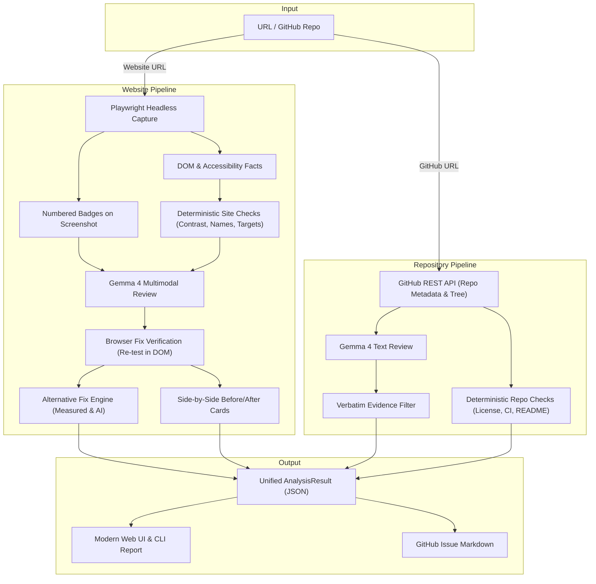

# SightLine Architecture & Design

SightLine is an AI-assisted inspector engineered to audit websites for accessibility (WCAG 2.1/2.2) and public GitHub repositories for open-source health.

It combines **deterministic measured rules** (100% confidence, zero hallucinations) with **Gemma 4** multimodal reasoning, followed by an **in-browser fix verification engine** that visually validates fixes before presenting them.

---

## 1. High-Level Architecture Diagram



---

## 2. Core Pipelines Walkthrough

### 2.1 Website Inspection Pipeline (`sightline/pipeline.py`)

1. **SSRF Guard & Fetch**: The URL is validated against private, link-local, loopback, and cloud metadata IP ranges (`sightline.site.capture.validate_url`).
2. **Headless Browser Capture**: Playwright loads the page, injects an extraction script, records interactive elements, computing CSS styles, bounding boxes (`Box`), and accessible names. A full-page screenshot is captured.
3. **Badge Marking**: `sightline.site.marks` draws high-contrast numbered badges over interactive elements on the screenshot.
4. **Measured Checks**: Deterministic checks evaluate:
   - `low-contrast`: Relative luminance calculations according to WCAG 2.1 algorithm.
   - `missing-name`: Interactive controls (`button`, `a`, `input`) missing accessible names.
   - `small-target`: Tap targets below the WCAG 2.2 threshold of 24x24px.
5. **Gemma 4 Multimodal Review**: Gemma evaluates the numbered screenshot alongside element metadata to detect visual hierarchy defects, layout issues, and confusing iconography.
6. **Evidence Verification & Re-Testing (`sightline.site.verify`)**:
   - Reopens the page once in Playwright.
   - For up to 10 findings within a 15-second cap, applies fixes using strictly fixed deterministic code paths:
     - `missing-name`: Sanitizes and applies `aria-label`.
     - `low-contrast`: Verifies hex color regex `^#[0-9a-fA-F]{6}$` and applies `style.color`.
     - `small-target`: Applies `min-width: 24px; min-height: 24px`.
   - Re-collects element facts in the DOM and re-runs the rule function. If it passes, marks `verified=True`.
   - Captures side-by-side cropped BEFORE (red bounding box) and AFTER (green bounding box) comparison images.
7. **Alternative Fix Generation (`sightline.site.alternatives`)**: Generates 1 to 2 alternatives with computed WCAG contrast trade-offs (closest passing color, adjust background, maximum contrast).

### 2.2 Repository Inspection Pipeline (`sightline/pipeline.py`)

1. **Metadata & Tree Ingestion**: Fetches repo details (stars, forks, open issues, license, pushed date) and the repository git tree from GitHub REST API via `httpx`.
2. **Deterministic Checks (`sightline/repo/checks.py`)**:
   - Checks presence of open source `LICENSE`.
   - Detects CI workflows in `.github/workflows/`.
   - Evaluates test suite presence, contributing guides, and unverified README commands.
3. **Gemma 4 Ingestion**: Feeds README contents, file tree, and key documentation to Gemma.
4. **Strict Verbatim Verification**: Gemma findings must supply an exact `evidence` substring present in the scanned files. Hallucinated quotes or nonexistent file paths are dropped immediately.

---

## 3. Data Models (`sightline/models.py`)

- **`Box`**: Spatial bounding rectangle (`x`, `y`, `w`, `h`) in CSS pixels.
- **`Element`**: Captured interactive DOM element with `number`, `selector`, `tag`, `text`, `box`, `name`, and `meta`.
- **`PageSnapshot`**: Captured web page state, dimensions, screenshot path, and element list.
- **`RepoSnapshot`**: Repository metadata, file listing, README text, and key file snippets.
- **`Finding`**: Core entity representing a defect or improvement:
  - `id`: Unique identifier (e.g., `site-001`, `repo-002`).
  - `source`: `"measured"` (code-verified) or `"ai"` (Gemma).
  - `target`: `"site"` or `"repo"`.
  - `rule`: Specific rule name (`low-contrast`, `missing-name`, `small-target`, etc.).
  - `severity`: `"high"`, `"medium"`, or `"low"`.
  - `problem`, `why_it_matters`, `fix`: Plain language explanations.
  - `evidence`: Precise mathematical measurement or verbatim text quote.
  - `verified`: Boolean indicating if the fix was confirmed passing in the browser.
  - `compare_image` / `compare_note`: Visual diff URL and metric diff string.
  - `alternatives`: List of alternative fix strategies with trade-offs.
- **`AnalysisResult`**: Complete bundle returned to callers, containing all findings, stats, issues, and metadata.

---

## 4. Gemma 4 Integration & Hard Rules

- **Exclusively Gemma**: SightLine strictly uses Gemma models (default: `gemma-4-26b-a4b-it`) via the Gemini API (`google-genai`).
- **Thinking Configuration**: Configurable via `GEMMA_THINKING` (default: `minimal`). Minimal thinking dramatically speeds up structured JSON extraction while preserving accuracy. If an endpoint or SDK rejects thinking configuration, SightLine automatically logs a clear warning and falls back to a clean retry.
- **Loose JSON Parser (`parse_json_loose`)**: Robustly handles markdown code fences (` ```json `), partial text wrappers, and whitespace variations.
- **Disk Caching**: SHA-256 keyed cache (`.cache/gemma/`) avoids redundant API calls and preserves test budgets.

---

## 5. Security & Isolation Model

1. **SSRF Guardrails**: Hostname resolution rejects private subnets, loopbacks, link-local metadata addresses (`169.254.169.254`), and invalid schemes.
2. **Zero Code Execution**: LLM outputs are treated as untrusted text. No model output is ever executed via `eval()`, `exec()`, or dynamic scripting.
3. **Fixed Fix Paths**: Fix verification applies DOM mutations through predetermined, sanitized code paths only.
4. **Environment Isolation**: API tokens (`GEMINI_API_KEY`, `GITHUB_TOKEN`) are never hard-coded or logged.
